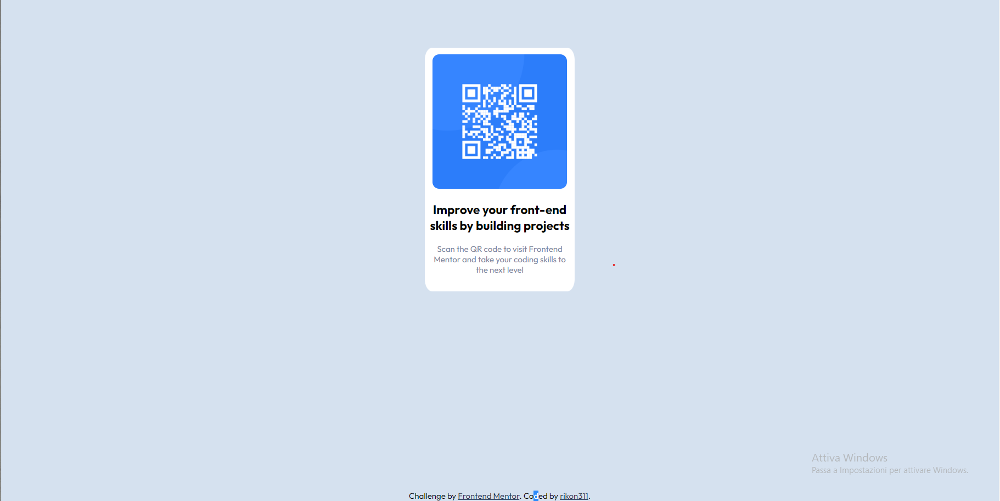

# Frontend Mentor - QR code component solution

This is a solution to the [QR code component challenge on Frontend Mentor](https://www.frontendmentor.io/challenges/qr-code-component-iux_sIO_H). Frontend Mentor challenges help you improve your coding skills by building realistic projects. 

## Table of contents

- [Overview](#overview)
  - [Screenshot](#screenshot)
  - [Links](#links)
- [My process](#my-process)
  - [Built with](#built-with)
  - [Continued development](#continued-development)
- [Author](#author)

**Note: Delete this note and update the table of contents based on what sections you keep.**

## Overview

I Tried to recreate the design of the card simply using CSS properties and media queries for the Mobile design. I'm sure that the proprtion are a bit different from the original design but I'm  trying to working on it.

### Screenshot

### Links

- Solution URL: (https://github.com/rikon311/qr-code-challenge-frontend-mentor)
- Live Site URL: (https://rikon311.github.io/qr-code-challenge-frontend-mentor/)

## My process

### Built with

- Semantic HTML5 markup
- CSS custom properties

### Continued development

I want to fix a bit the design for both the Mobile and Desktop design. I would like in the future to redo this challenge by using some frameorks maybe (Angular or React maybe). I just wanted to test my CSS skills with this first challenge. I always sucked with CSS, but I want to improve my front-end skills. 

## Author

- Github: (https://github.com/rikon311)
- Frontend Mentor: (https://www.frontendmentor.io/profile/rikon311)
- Instagram: (https://www.instagram.com/ricon311/?next=%2F)
- Linkedin: (https://www.linkedin.com/in/riccardo-polidoro-b01963240/)

